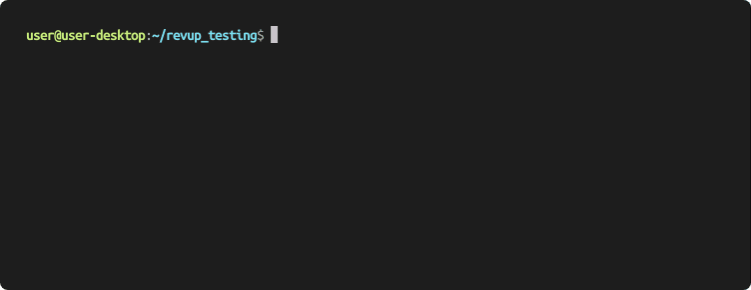

<!-- PYPI_REMOVE -->
<picture>
  <source media="(prefers-color-scheme: dark)" srcset="docs/images/revup_dark.svg">
  <source media="(prefers-color-scheme: light)" srcset="docs/images/revup_light.svg">
<!-- /PYPI_REMOVE -->
  
<!-- PYPI_REMOVE -->
</picture>
<!-- /PYPI_REMOVE -->

Revup provides command-line tools that allow developers to iterate faster on parallel changes and reduce the overhead of creating and maintaining code reviews.

# Section

## sub

This is [my web page](mywebpage/index.html).
