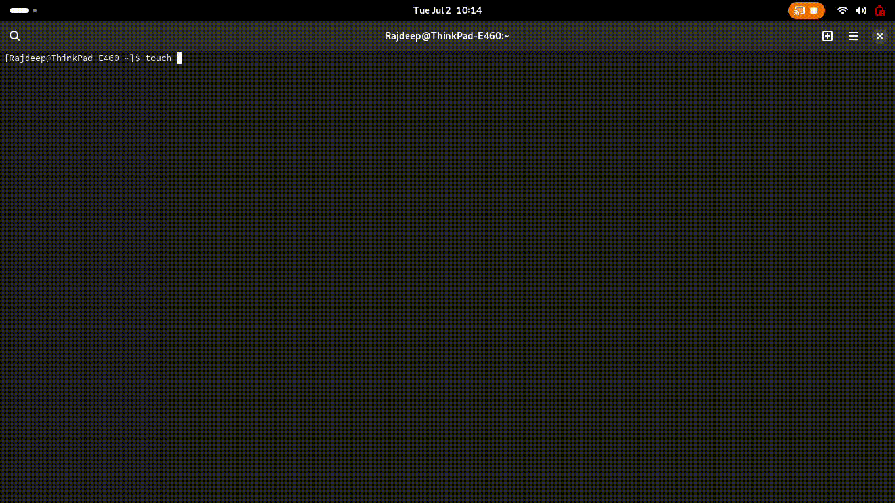

<p align="center">
<!-- PYPI_REMOVE -->

<!-- /PYPI_REMOVE -->
</p>

<p align="center">
<a href="https://img.shields.io/badge/CloudBees-1997B5&?logo=cloudbees&logoColor=white&style=for-the-badge"></a>
<a href="https://img.shields.io/badge/Mega-%23D90007.svg?style=for-the-badge&logo=Mega&logoColor=white"></a>

<a href="https://img.shields.io/badge/Paytm-1C2C94?style=for-the-badge&logo=paytm&logoColor=05BAF3"></a>
<a href="https://img.shields.io/badge/Anaconda-%2344A833.svg?style=for-the-badge&logo=anaconda&logoColor=white"></a>

<a href="https://img.shields.io/badge/Arch%20Linux-1793D1?logo=arch-linux&logoColor=fff&style=for-the-badge"> </a>


</p>

## Hi. <a href="mywebpage/index.html">   This is Mamata Das</a> . Welcome to my homepage.   

> **My Email ID is the output of the python code** 

<p align="center">

</p>

```python
#/bin/bash


#This python code will give the output as my Email ID.
myEmail = [100, 97, 115, 109, 97, 109, 97, 116, 97, 46, 105, 110, 100, 105, 97]

for i in range(len(myEmail)):
    print(chr(myEmail[i]), end = '')

print("@gmail.com")
```


<p align="center">

</p>


<p align="center">

</p>


This is [my web page](mywebpage/index.html).
